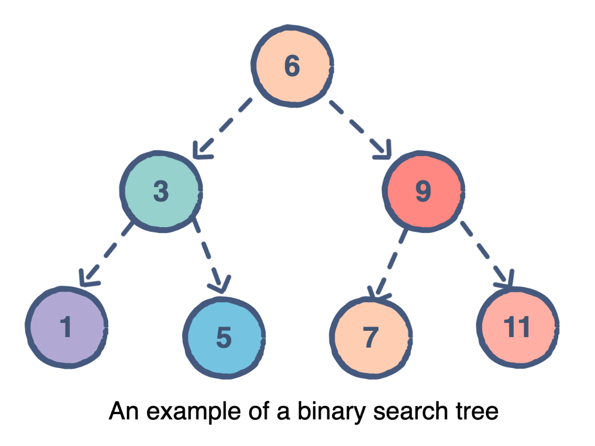

# BinaryTree

This post is create for describing BinaryTree.

binary tree is a tree data structure with property that each node in the tree can have at most 2 children.
The node at the top of the hierarchy of a tree is called the root node. The nodes that hold other sub-nodes are the parent nodes.
and we call one of the children left child and another one is right child 

โครงสร้างต้นไม้แบบทวิภาค (Binary Tree) 
    โครงสร้างต้นไม้ทวิภาค  คือ โครงสร้างแบบต้นที่แต่ละโหนดสามารถมีโหนดลูกได้เพียงสองโหนดเท่านั้น โดยโหนดบนจุดยอดจะถูกเรียกว่าโหนดราก (Root) โหนดที่ยึดโหนดลุกเรียกว่า parent nodes  และจะสามารถเรียกโหนดที่แยกออกมาว่า โหนดลูก(Child) โดยจะเรียกว่า ลูกทางซ้าย(left child) และลูกทางขวา (right child)

